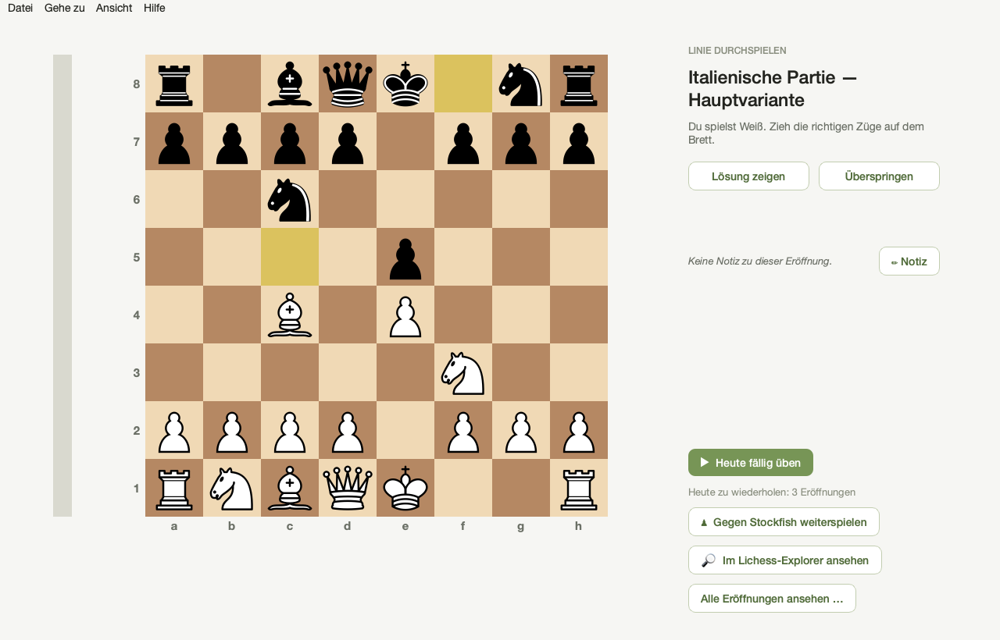
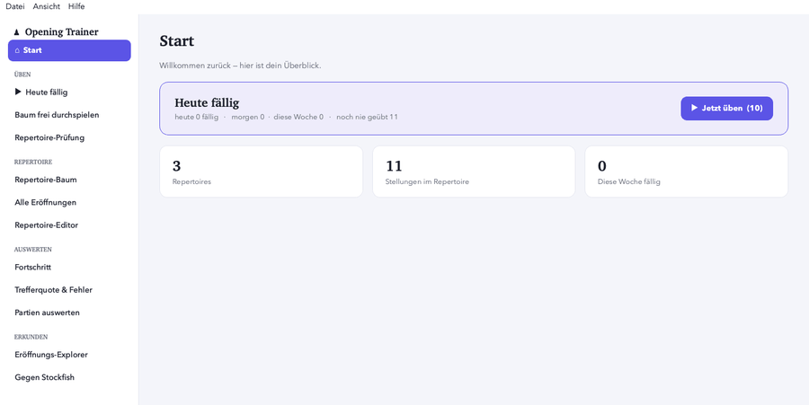

# Opening Trainer

[English](README.md) · **Deutsch**

[](https://ko-fi.com/vancoeur)

Ein persönlicher Schach-**Eröffnungstrainer** für den Mac — übe deine eigenen
Repertoires (Weiß und Schwarz) mit **Spaced Repetition**, baue und korrigiere sie
in einem eingebauten **Editor** (samt Varianten), wiederhole gezielt Fehlzüge und
lass dein Material *und* deine gespielten Partien von **Stockfish** prüfen.

> Moderne Qt/PySide6-Oberfläche. Stockfish ist fest eingebaut — die App läuft
> eigenständig, ohne weitere Installation. Die Oberfläche gibt es auf
> **Deutsch und Englisch**.



*Oberfläche auf **Deutsch und Englisch** (Ansicht → Sprache). Hier auf Deutsch — das [gleiche Fenster auf Englisch](docs/screenshot.en.png).*

**Der erste Start in 13 Sekunden** — ein Klick auf die Beispiel-Eröffnungen, und das Training läuft:



## Download (fertige App)

**[⬇ Neueste Version herunterladen](https://github.com/vancoeur/chess-opening-trainer/releases/latest)** — entpacken und `Opening Trainer.app` in den Ordner `Programme` ziehen. Benötigt einen Mac mit **Apple Silicon** (M1 oder neuer); Intel-Macs werden von diesem Build nicht unterstützt.

> Der **[Änderungsverlauf](CHANGELOG.md)** (englisch) listet, was in jeder Version dazugekommen oder erweitert wurde.

> **⚠️ Wichtig — erster Start (Gatekeeper):**
> Die App ist **nicht signiert/notarisiert** (freies Open-Source-Projekt ohne
> Apple-Developer-Abo). macOS **blockiert deshalb den ersten Start** mit einer
> Meldung wie *„Opening Trainer" kann nicht geöffnet werden*. Das ist zu erwarten —
> die App ist sicher, und du kannst hier jede Zeile ihres Quellcodes einsehen.
>
> So öffnest du sie beim **ersten Mal**:
> 1. **Rechtsklick** (oder Ctrl-Klick) auf `Opening Trainer.app` → **Öffnen** → mit **Öffnen** bestätigen.
> 2. Falls deine macOS-Version dort keinen „Öffnen"-Knopf anbietet:
>    **Systemeinstellungen → Datenschutz & Sicherheit** öffnen, nach unten scrollen zu
>    *„Opening Trainer" wurde blockiert…* und **„Dennoch öffnen"** klicken, dann bestätigen.
>
> Das ist **nur einmal** nötig — danach startet die App ganz normal per Doppelklick.

Die App bringt **drei Beispiel-Eröffnungen** mit (Italienische Partie, Caro-Kann, Damengambit Abgelehnt) — du kannst also sofort alles ausprobieren und dein eigenes PGN-Repertoire laden, wann immer du so weit bist. Die Oberfläche folgt der Systemsprache (Deutsch/Englisch) und lässt sich jederzeit umschalten.

## Was die App kann

- **Tägliche Wiederholung (Spaced Repetition):** die App zeigt, was **heute
  fällig** ist — Stellung für Stellung, sodass transponierende Linien sich eine
  Karte teilen und nichts doppelt abgefragt wird. Eine **„Heute fällig"-Übersicht**
  schlüsselt es pro Eröffnung auf (*X fällig · Y neu*), zeigt einen Ausblick
  heute / morgen / diese Woche und lässt dich gezielt eine einzelne Eröffnung
  üben; nach jeder Antwort siehst du, wann die Stellung wieder fällig wird.
- **Repertoires bauen & bearbeiten — mit Varianten:** beim Laden einer PGN
  bleiben **Verzweigungen und Kommentare** erhalten; oder du baust und korrigierst
  ein Repertoire Zug für Zug im **eingebauten Editor** (Linien anhängen, eine
  Variante zur Hauptlinie machen, löschen, kommentieren, als PGN exportieren).
- **Am Brett üben** (Ziehen oder Klick-Klick) mit automatischen Gegnerzügen; oder
  in den Modus **„Linie durchspielen"** wechseln, um eine ganze Linie am Stück zu
  wiederholen.
- **Repertoire Weiß/Schwarz:** die Seite wird beim Laden aus dem Dateinamen
  erkannt; jederzeit zuordnen/ändern und eine ganze Seite oder dein gesamtes
  Repertoire trainieren.
- **Bibliothek** aller Eröffnungen mit **Suchfeld** und automatischen Gruppen
  (z. B. „Schwarz ▸ gegen 1.e4 ▸ Sizilianisch").
- **Auswertung** mit Fehlerprotokoll und gezieltem Fehler-Drill.
- **Fortschritt** — auf einen Blick sehen, welche Eröffnungen sitzen, wackeln
  oder noch nie geübt wurden, mit Filter nach Kategorie.
- **Notizen** — zu jeder Eröffnung einen persönlichen Merktext hinterlegen.
- **Stockfish-Funktionen:**
  - **Repertoire-Prüfung** — prüft jede zugeordnete Linie und meldet verdächtige
    Züge deiner Seite (Patzer/Ungenauigkeiten), damit du dir keine Fehler
    einprägst. Jeder Fund ist anklickbar zum Üben.
  - **„War mein Zug gut?"** — weichst du beim Üben vom Repertoire-Zug ab, sagt
    die Engine, ob dein Zug gleichwertig, ungenau oder ein Fehler war.
  - **Bewertungs-Leiste** beim Üben (abschaltbar im Menü „Ansicht").
  - **Sparring** — die Eröffnungsstellung gegen Stockfish ausspielen (drei
    Stärken), mit „Zug zurück" und Patzer-Hinweis.
- **Lichess-Eröffnungsexplorer** — sehen, was in jeder Stellung tatsächlich
  gespielt wird (Häufigkeiten und Weiß/Remis/Schwarz-Ergebnisse). Braucht einen
  kostenlosen Lichess-API-Token (ohne Berechtigungen).
- **Partien auswerten** — eine PGN deiner gespielten Partien laden (Lichess,
  chess.com, jede Plattform) und sehen, **wo du dein Repertoire verlassen** hast
  und, mit Stockfish, **wo du gepatzt** hast — mit Brett-Betrachter zum
  Durchblättern jeder Partie.
- **PGN laden** (einzelne Datei oder ganzer Ordner) — **Varianten bleiben
  erhalten** und speisen die Stellungs-Wiederholung. Deine PGN bleibt
  Originalmaterial; Trainingsdaten bleiben lokal und privat.
- **Deutsch / Englisch** — jederzeit umschaltbar über das Menü
  „Ansicht → Sprache" (greift nach Neustart). Auch die Eröffnungsnamen werden übersetzt.

## Voraussetzungen

- **macOS** (Apple Silicon / arm64 für das mitgelieferte Stockfish-Binary)
- **Python 3.10+**
- Python-Pakete: **PySide6**, **python-chess** (siehe `requirements.txt`)
- **Stockfish** — für die App-Verpackung mitgeliefert; beim Start aus dem
  Quellcode wird es unter `assets/engine/stockfish` oder im System gesucht
  (`brew install stockfish`).

## Aus dem Quellcode starten

```bash
python3 -m pip install -r requirements.txt
python3 qt_main.py
```

## Als eigenständige Mac-App bauen

```bash
./build_app.sh          # erzeugt: dist/Opening Trainer.app
```

Das Skript bündelt Stockfish automatisch mit (aus `assets/engine/stockfish`
oder deiner lokalen Installation). Die App ist **nicht signiert/notarisiert** —
auf einem fremden Mac beim ersten Start ggf. Rechtsklick → „Öffnen".

## Tests

```bash
python3 -m pytest -q
```

## Wo liegen meine Daten?

- **Aus dem Quellcode:** im Projektordner `data/`.
- **Verpackte App:** `~/Library/Application Support/Opening Trainer/`
  (Einstellungen, Statistik, Lernplan, Repertoire-Zuordnung).

Diese Dateien sind lokal und privat; sie werden nicht versioniert.

## Lizenz

Dieses Programm ist **freie Software** unter der **GNU General Public License
v3 oder später** (GPLv3+) — siehe [`LICENSE`](LICENSE).

Der Grund: Opening Trainer bindet **python-chess** (GPL-3.0+) ein und liefert
**Stockfish** (GPLv3) mit. Du darfst die App nutzen, weitergeben und verändern;
gibst du sie weiter, muss der Quellcode mitgegeben werden und die Empfänger
erhalten dieselben Freiheiten.

Mitverwendete fremde Bestandteile und ihre Lizenzen sind in
[`NOTICE.md`](NOTICE.md) aufgeführt (Stockfish, python-chess, Qt/PySide6,
Cburnett-Figuren).

## Unterstützen

Opening Trainer ist kostenlos und quelloffen — und bleibt es. Wenn es deinem
Schach hilft und du Danke sagen möchtest, freue ich mich über
[einen Kaffee auf Ko-fi](https://ko-fi.com/vancoeur) ☕ — völlig freiwillig und
hält das Projekt am Leben.

## Aufbau (Kurzüberblick)

- `qt_main.py` — Startpunkt der Qt-Oberfläche
- `qt_app/` — Oberfläche (Fenster, Brett, Stockfish-/Lichess-Anbindung)
- `opening_trainer/` — toolkit-unabhängige Fachlogik (PGN, Training, Spaced
  Repetition, Statistik, Urteilslogik), getestet unter `tests/`
- `assets/` — Figurengrafiken, App-Icon, mitgeliefertes Stockfish
- `legacy/` — das frühere Tkinter-Programm (archiviert, weiter lauffähig)

## Entwicklungsprinzipien

- Erst Tests, dann Oberfläche.
- Fachlogik und Oberfläche getrennt halten.
- Kleine, gesicherte Schritte; PGN bleibt Originalmaterial.
- Trainingsdaten bleiben lokal und privat.
