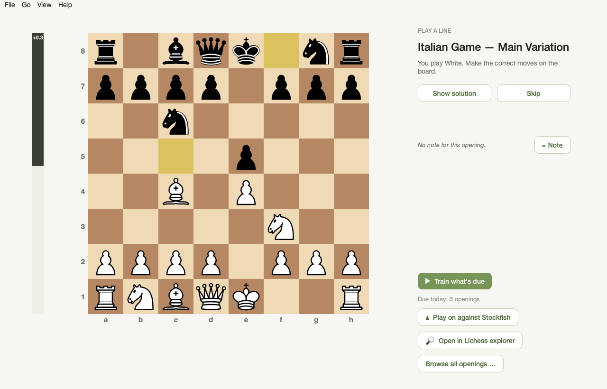
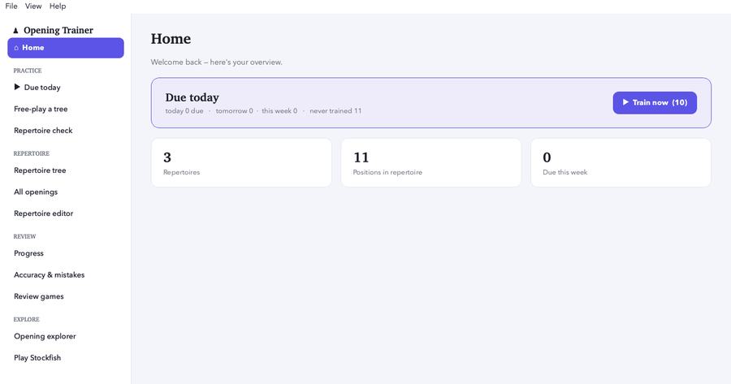

# Opening Trainer

**English** · [Deutsch](README.de.md)

[](https://ko-fi.com/vancoeur)

A personal chess **opening trainer** for the Mac — practice your own
repertoires (White and Black) with **spaced repetition**, build and correct them
in a built-in **editor** (variations and all), drill the moves you keep getting
wrong, and have **Stockfish** check your lines and your played games.

> Modern Qt/PySide6 interface. Stockfish is bundled — the app runs on its own,
> no extra installation. The interface is available in **English and German**.



**First start in 13 seconds** — one click on the sample openings and you’re training:



## Download (ready-to-run app)

**[⬇ Download the latest release](https://github.com/vancoeur/chess-opening-trainer/releases/latest)** — unzip and drag `Opening Trainer.app` into your `Applications` folder. Requires a Mac with **Apple Silicon** (M1 or newer); Intel Macs are not supported by this build.

> **⚠️ Important — first launch (Gatekeeper):**
> The app is **not signed or notarised** (this is a free, open-source project without
> an Apple Developer subscription). macOS will therefore **block the first start**
> with a message like *“Opening Trainer” can’t be opened*. This is expected — the app
> is safe, and you can inspect every line of its source code right here.
>
> To open it the **first time**:
> 1. **Right-click** (or Ctrl-click) `Opening Trainer.app` → **Open** → confirm **Open**.
> 2. If your macOS version offers no “Open” button there: open
>    **System Settings → Privacy & Security**, scroll down to
>    *“Opening Trainer” was blocked…* and click **“Open Anyway”**, then confirm.
>
> This is needed **only once** — afterwards the app starts normally by double-click.

The app ships with **three sample openings** (Italian Game, Caro-Kann, Queen’s Gambit Declined) so you can try everything immediately — load your own PGN repertoire whenever you’re ready. The interface follows your system language (English/German) and can be switched any time.

## What it does

- **Daily review (spaced repetition):** the app shows what’s **due today** —
  position by position, so transposing lines share one card and nothing is
  reviewed twice. A **“Due today” overview** breaks it down per opening
  (*X due · Y new*), forecasts today / tomorrow / this week, and lets you drill a
  single opening; after each answer it shows when the position is next due.
- **Build & edit repertoires — with variations:** loading a PGN keeps its
  **branches and comments**; or build and correct a repertoire move by move in
  the **in-app editor** (add lines, promote a variation to the main line, delete,
  comment, export back to PGN).
- **Practice on the board** (drag or click-click) with automatic opponent
  replies; or switch to **“play a line”** mode to rehearse a whole line end to
  end.
- **White/Black repertoire:** the side is auto-detected from the file name on
  load; assign or change it any time, and train a whole side or your whole
  repertoire.
- **Library** of all openings with a **search field** and automatic groups
  (e.g. “Black ▸ vs 1.e4 ▸ Sicilian”).
- **Analysis** with a mistake log and targeted mistake drills.
- **Progress** view — see at a glance which openings are solid, shaky or
  untrained, and filter by category.
- **Notes** — keep a personal reminder on any opening.
- **Stockfish features:**
  - **Repertoire check** — scans every assigned line and flags suspicious moves
    of your side (blunders / inaccuracies), so you don’t memorise mistakes.
    Each finding is clickable to train.
  - **“Was my move good?”** — when you deviate while practising, the engine
    tells you whether your move was equal, slightly worse, or a mistake.
  - **Evaluation bar** while practising (toggle in the “View” menu).
  - **Sparring** — play the opening position out against Stockfish (three
    strengths), with take-back and a blunder hint.
- **Lichess opening explorer** — see what is actually played in each position
  (move frequencies and white/draw/black results). Requires a free Lichess API
  token (no permissions needed).
- **Review your games** — load a PGN of your played games (Lichess, chess.com,
  any platform) and see **where you left your repertoire** and, with Stockfish,
  **where you blundered** — with a board viewer to step through each game.
- **Load PGN** (single file or whole folder) — **variations are kept** and feed
  the position review. Your PGN stays original material; training data stays
  local and private.
- **English / German interface** — switch any time via the “View → Language”
  menu (takes effect after a restart). Opening names are translated too.

## Requirements

- **macOS** (Apple Silicon / arm64 for the bundled Stockfish binary)
- **Python 3.10+**
- Python packages: **PySide6**, **python-chess** (see `requirements.txt`)
- **Stockfish** — bundled for the packaged app; when running from source it is
  found under `assets/engine/stockfish` or in your system (`brew install
  stockfish`).

## Run from source

```bash
python3 -m pip install -r requirements.txt
python3 qt_main.py
```

## Build a standalone Mac app

```bash
./build_app.sh          # produces: dist/Opening Trainer.app
```

The script bundles Stockfish automatically (from `assets/engine/stockfish` or
your local installation). The app is **not signed/notarised** — on another Mac,
right-click → “Open” on first launch.

## Tests

```bash
python3 -m pytest -q
```

## Where is my data?

- **From source:** in the project folder `data/`.
- **Packaged app:** `~/Library/Application Support/Opening Trainer/`
  (settings, statistics, schedule, repertoire assignment).

These files are local and private; they are not version-controlled.

## License

This program is **free software** under the **GNU General Public License v3 or
later** (GPLv3+) — see [`LICENSE`](LICENSE).

Why: Opening Trainer uses **python-chess** (GPL-3.0+) and bundles **Stockfish**
(GPLv3). You may use, share and modify the app; if you pass it on, the source
must come with it and recipients get the same freedoms.

Third-party components and their licenses are listed in [`NOTICE.md`](NOTICE.md)
(Stockfish, python-chess, Qt/PySide6, Cburnett pieces).

## Support

Opening Trainer is free and open source, and always will be. If it helps your
chess and you’d like to say thanks, you can
[buy me a coffee on Ko-fi](https://ko-fi.com/vancoeur) ☕ — completely optional,
hugely appreciated, and it keeps the project going.

## Layout (overview)

- `qt_main.py` — entry point of the Qt interface
- `qt_app/` — interface (window, board, Stockfish/Lichess integration)
- `opening_trainer/` — toolkit-independent core logic (PGN, training, spaced
  repetition, statistics, judgement logic), tested under `tests/`
- `assets/` — piece graphics, app icon, bundled Stockfish
- `legacy/` — the earlier Tkinter program (archived, still runnable)

## Development principles

- Tests first, then UI.
- Keep core logic and interface separate.
- Small, secured steps; PGN stays original material.
- Training data stays local and private.
