# Opening Trainer — Bedienungshandbuch

Persönlicher Schach-Eröffnungstrainer für macOS · Stand Juni 2026

Dieses Handbuch erklärt jede Funktion Schritt für Schritt, in Alltags- und
Schachsprache. Du brauchst keine Vorkenntnisse außer Schach. Die Screenshots
zeigen die App auf Deutsch mit einem geladenen Beispiel-Repertoire (Caro-Kann).

---

## 1. Was die App für dich tut

Du übst deine Eröffnungen **Stellung für Stellung** (wie bei Chessable oder Anki):
Die App zeigt dir ein Brett, du spielst den Zug, der in *deinem* Repertoire
vorgesehen ist — und ein **Lernplan** sorgt dafür, dass du Stellungen, die du
vergisst, öfter wiederholst und sichere seltener.

Dazu kommen Werkzeuge, die ein reiner Karteikasten nicht hat:
- **Stockfish** prüft, ob deine Varianten objektiv gut sind.
- Deine **echten Partien** werden mit deinem Repertoire verglichen.
- Ein **Repertoire-Baum** zeigt dein ganzes Repertoire als verzweigte Übersicht — inklusive **Lücken**, die du noch füllen solltest.

Dein Repertoire bringst du als **PGN-Datei(en)** mit; die App macht daraus
verzweigte Bäume und besitzt sie dann selbst (speichern, üben, bearbeiten).

---

## 2. Erste Schritte — Repertoire laden

1. Menü **Datei → PGN laden …** (⌘O) für eine Datei, oder **Ordner laden …** (⇧⌘O) für einen ganzen Ordner.
2. Die App fragt: **„Welche Farbe spielst du in dieser Datei?"** — wähle die Farbe, in der du dieses Repertoire spielst. (Bei Ordnern errät sie die Farbe oft aus dem Dateinamen.)
3. Danach erscheint ein **Baum-Bericht**, z. B. *„Schwarz: 23 Linien → 1 Baum mit 15 Verzweigungen"* — so siehst du sofort, ob deine Datei einen echten verzweigten Baum ergibt. Ein Knopf bringt dich direkt in den Repertoire-Baum.

> Geladene Repertoires **bleiben beim Neustart erhalten** — du musst nichts erneut laden. Mehrere Dateien/Ordner werden zusammengeführt. Hast du noch keine eigene PGN, bietet die Startseite **„Beispiel-Eröffnungen ausprobieren"**.

---

## 3. Die Seitenleiste & die Startseite

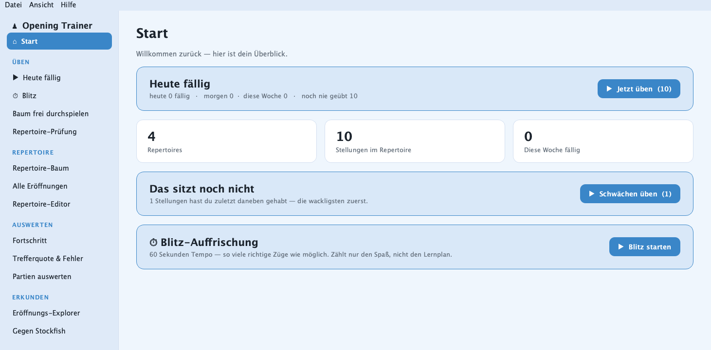

Links liegt die **Navigations-Seitenleiste** — sie ist auf **jeder** Seite sichtbar
und bringt dich überallhin, gruppiert in vier Bereiche:

- **Üben:** Heute fällig · ⏱ Blitz · Baum frei durchspielen · Repertoire-Prüfung
- **Repertoire:** Repertoire-Baum · Alle Eröffnungen · Repertoire-Editor
- **Auswerten:** Fortschritt · Trefferquote & Fehler · Partien auswerten
- **Erkunden:** Eröffnungs-Explorer · Gegen Stockfish

Die Seite, auf der du gerade bist, ist in der Leiste **farbig markiert**. Ganz oben
führt **Start** (⌘1) auf die hier gezeigte **Übersicht**: eine große
**„Heute fällig"-Karte** mit dem Knopf **„Jetzt üben"**, darunter drei Kennzahlen —
wie viele **Repertoires**, wie viele **Stellungen** und wie viel **diese Woche
fällig** ist. Darunter erscheinen — sobald sie etwas zu zeigen haben — zwei weitere
Karten: **„Das sitzt noch nicht"** (deine wackligen Stellungen, siehe 4.4) und
**„Blitz-Auffrischung"** (kurzer Tempo-Modus, siehe 4.5). (Hast du noch kein
Repertoire, steht hier stattdessen **„Beispiel-Eröffnungen ausprobieren".)**

> **Orientierung:** Die markierte Seite in der Leiste und der Fenstertitel zeigen immer, wo du gerade bist. Mit **„‹ Zurück"** geht es zur vorigen Seite.

---

## 4. Das tägliche Üben

### 4.1 Übersicht „Heute fällig"

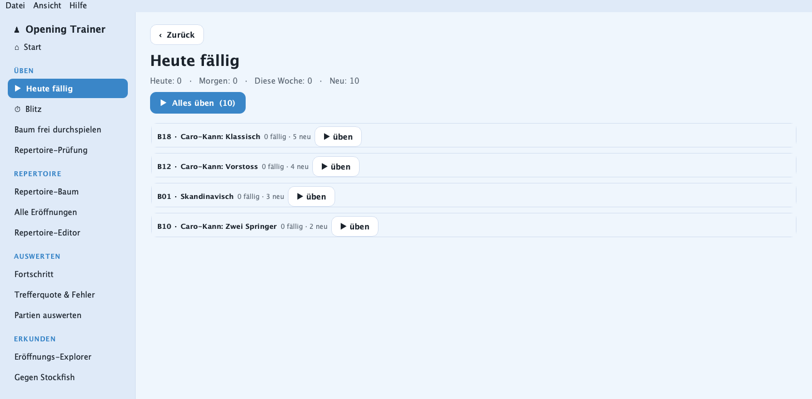

Einstieg: der Knopf **„Jetzt üben"** auf der Startseite oder in der Seitenleiste
**Üben → Heute fällig** (⌘D). Du siehst eine Vorschau (heute / morgen / diese Woche
/ neu) und **pro Eröffnung**,
wie viel fällig bzw. neu ist — jeweils mit eigenem „üben"-Knopf. **„Alles üben"**
startet die ganze Tagessitzung.

### 4.2 Die Übe-Ansicht (Abfrage)

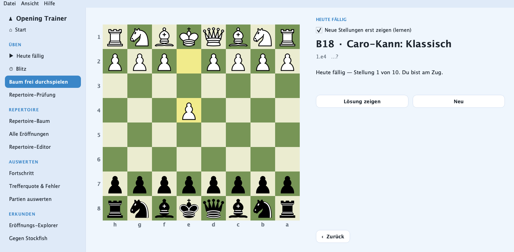

Alles auf einem Bildschirm, kein Hin- und Herspringen:

- **Brett** links — du bist am Zug. Zieh den vorgesehenen Zug.
- **Linien-Kontext** (z. B. „1.e4 …?") — zeigt, *wo* in der Linie du bist.
- **„Idee"** zur Stellung — falls in deiner PGN ein Kommentar steht.
- **Feedback** — z. B. „✓ Sitzt — nächste Wiederholung in 4 Tagen".
- Knöpfe: **Lösung zeigen** (Taste **L**), **Überspringen** (Taste **Enter**).

Richtig → der Gegnerzug kommt automatisch, nächste Stellung. Falsch → kurzer
Hinweis, du versuchst es erneut.

### 4.3 Learn-Modus — neue Stellungen erst zeigen

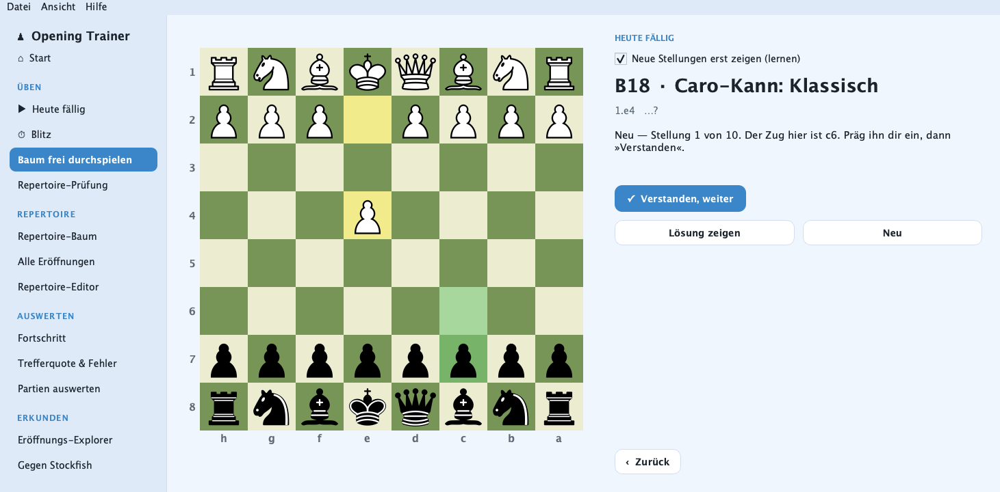

Das Häkchen **„Neue Stellungen erst zeigen (lernen)"** (standardmäßig an) macht den
Einstieg sanft: Eine **neue** Stellung wird dir **mit der Lösung gezeigt** (der Zug
ist grün am Brett markiert, Text: „Der Zug hier ist …"). Du musst **nicht raten** —
ein Klick auf **„✓ Verstanden, weiter"** merkt sie vor und geht zur nächsten. Schon
**gelernte** Stellungen werden weiterhin abgefragt.

### 4.4 Schwächen üben — „Das sitzt noch nicht"

Die App merkt sich die Stellungen, in denen du **zuletzt daneben** gegriffen hast.
Gibt es solche, erscheint auf der Startseite die Karte **„Das sitzt noch nicht"** mit
dem Knopf **„Schwächen üben"** — der übt **gezielt nur diese** Stellungen, die
häufigsten Fehler zuerst. Das ist bewusst etwas anderes als „Heute fällig": Eine
Stellung kann laut Lernplan **nicht** dran sein, dir aber **trotzdem** jedes Mal
durchrutschen — genau die holt dich hier ab. Eine Runde ist auf die hartnäckigsten
gedeckelt, damit sie kurz bleibt; der Rest kommt in der nächsten Runde.

Dieselbe Liste findest du auch unter **Auswerten → Trefferquote & Fehler** (⌘3): dort
kannst du eine einzelne Stellung anklicken **oder** mit **„Alle üben"** die ganze
Liste am Stück nehmen.

### 4.5 Blitz-Auffrischung — gegen die Uhr

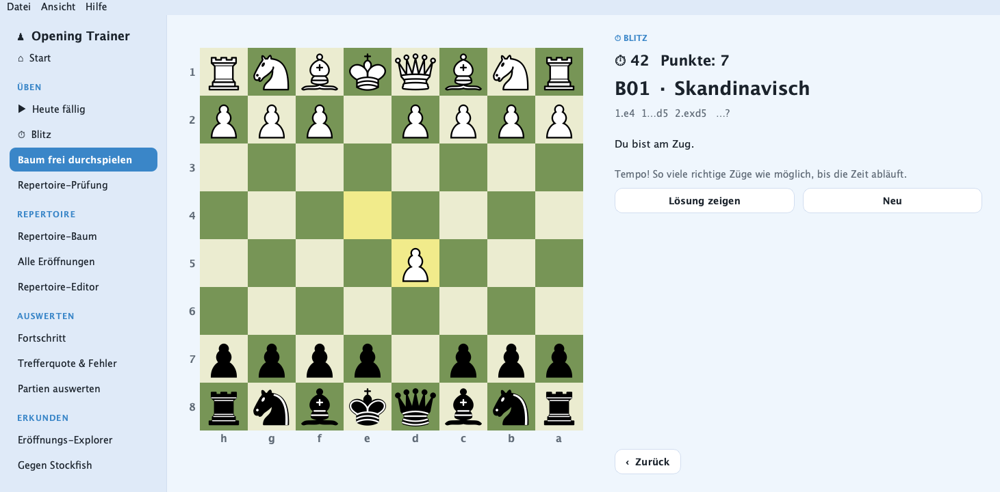

Einstieg: die Karte **„Blitz-Auffrischung"** auf der Startseite oder **Üben → ⏱ Blitz**
in der Seitenleiste. Es läuft eine **Uhr (60 Sekunden)** und ein **Punktestand**:
Stellungen aus deinem **ganzen Repertoire** kommen schnell nacheinander, jeder
richtige Zug ist ein Punkt. Gehen die Aufgaben durch, mischt der Vorrat neu — in 60
Sekunden geht dir nie etwas aus. Läuft die Zeit ab, siehst du deinen **Endstand**;
**„Neu"** startet eine frische Runde.

Der Blitz ist eine **lockere Tempo-Übung**: Er **zählt nur den Punktestand** und
**rührt deinen Lernplan und die Fehler-Statistik nicht an** — schnelles Klicken
verschiebt deine echten Wiederholungs-Termine also nicht. Ein Fehlzug blinkt kurz
(ohne die Lösung zu verraten), du darfst es gleich nochmal versuchen.

---

## 5. Wie der Lernplan entscheidet (Spaced Repetition)

Die App entscheidet **selbst**, was heute dran ist (Anki-Prinzip) — du musst nichts
auswählen. Nach jeder richtigen Antwort rückt die nächste Wiederholung weiter in die
Zukunft (1 Tag → mehrere Tage → …); bei Fehlern kommt die Stellung bald wieder.
**Gleiche Stellungen über verschiedene Zugwege (Transpositionen) zählen als eine** —
du übst sie nicht doppelt. „Neu" sind noch nie geübte Stellungen; sie werden **nach
und nach** eingeführt, nicht alle auf einmal.

---

## 6. Der Repertoire-Baum (⌘R)

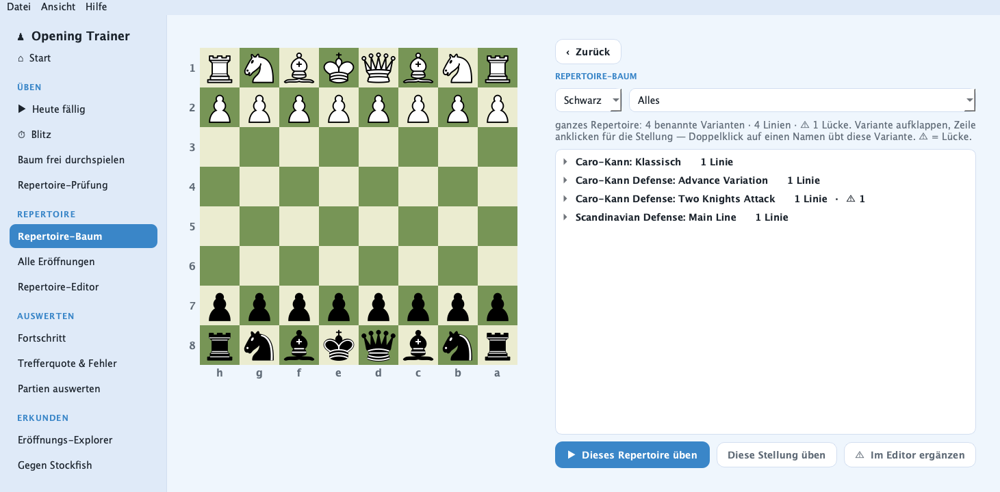

Hier siehst du dein Repertoire **nach Varianten gegliedert** — kein endloses
Scrollen mehr.

- **Zwei Auswahlfelder oben:** links die **Seite** (Weiß/Schwarz), rechts das **konkrete Repertoire** — „Alles" oder eine benannte Eröffnung (z. B. „Caro-Kann", „London-System"). So zeigst du gezielt **ein** Repertoire.
- **Benannte Varianten als aufklappbarer Baum:** Oben stehen — fett, in der Akzentfarbe — die **Varianten-Namen** mit Anzahl Linien und ⚠ Lücken. Die Namen kommen aus einer eingebauten **ECO-Eröffnungsdatenbank** (z. B. „Advance Variation", „Panov Attack", „Two Knights Attack"). Klick auf einen Namen **klappt die Variante auf** — der gerade Zug-Strang öffnet sich automatisch bis zur ersten echten **Verzweigung (⎇)**; tiefere Äste öffnest du nach Bedarf.
- **Wenn ECO keinen eindeutigen Namen findet** (typisch bei Aufbausystemen wie dem **London-System**, die in fremde Schubladen transponieren), nimmt die App stattdessen deinen **eigenen Kapitelnamen** aus der PGN (gesäubert) — nie ein falsches Etikett.
- **Lehrmaterial** (Einführungen, Musterpartien, Mittelspiel-Pläne) wird in **einer** Sammelgruppe **„Lehrmaterial"** ganz unten gebündelt, nicht unter die Varianten gemischt.
- **Lücken (⚠):** eine ⚠-Zeile bedeutet — die Linie endet, **du bist am Zug, aber es ist keine Antwort hinterlegt**. Klick die Zeile, dann **„⚠ Im Editor ergänzen"** springt genau dorthin.
- **Üben:** **Doppelklick auf einen Varianten-Namen** übt genau diese Variante. **„▶ Dieses Repertoire üben"** nimmt die ganze Auswahl; **„Diese Stellung üben"** drillt die angeklickte Stellung.

> Der Repertoire-Baum ist zugleich deine **To-do-Liste**: Wo ein ⚠ steht, fehlt dir noch eine Antwort.

---

## 7. Der Repertoire-Editor (⌘E)

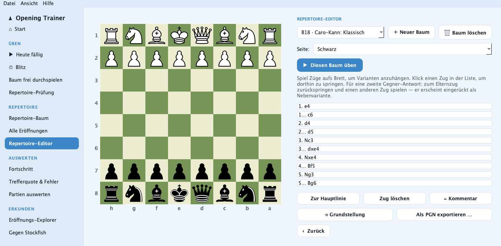

Hier **baust und korrigierst** du Bäume.

- Oben den Baum wählen oder **„Neuer Baum"** (fragt die Seite).
- **Zug aufs Brett spielen** = anhängen oder navigieren. So baust du Varianten: an einer Stellung einen zweiten eigenen Zug oder weitere Gegner-Antworten hinzufügen.
- Die **eingerückte Zugliste** rechts ist klickbar (💬 = Kommentar).
- Knöpfe: **„Zur Hauptlinie"**, **„Zug löschen"**, **„✏ Kommentar"**, **Seite**, **„Als PGN exportieren"**, **„🗑 Baum löschen"**. Jede Änderung wird sofort gespeichert.

---

## 8. Repertoire-Prüfung (⌘6)

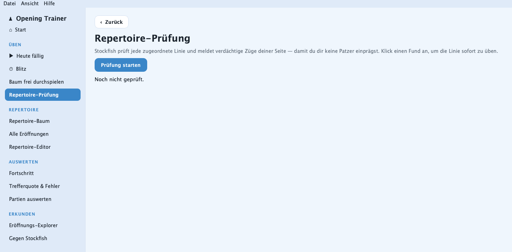

**Stockfish** geht **alle Varianten** deines Repertoires durch und meldet
**Patzer/Ungenauigkeiten** in *deinen* hinterlegten Zügen („besser wäre Z"). So
findest du schwache Stellen in deiner Vorbereitung. Klick einen Fund an, um die
Variante zu üben oder im Editor zu korrigieren. (Stockfish ist eingebaut.)

---

## 9. Partien auswerten (⌘5)

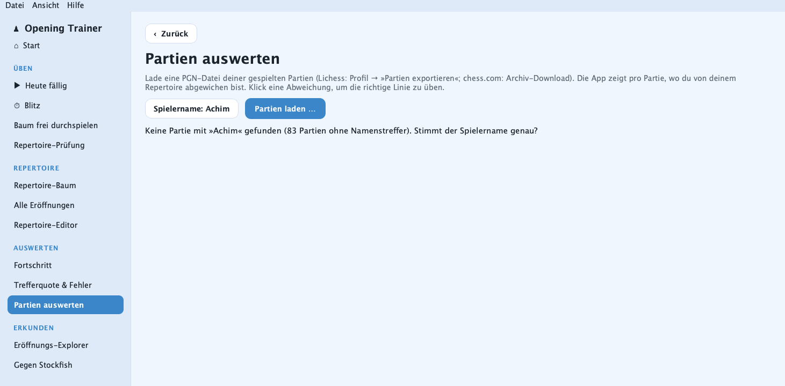

1. Trag einmal deinen **Spielernamen** ein (Lichess/chess.com), damit die App pro Partie deine Farbe kennt.
2. **PGN deiner Partien laden.** Die App vergleicht jede Partie mit deinem Repertoire (varianten-bewusst) und zeigt: **abgewichen**, **Eröffnung ungedeckt** oder **gefolgt**.
3. Klick eine Partie an → **Betrachter:** durchblättern; an der Abweichung steht „dein Repertoire: … — du spieltest: …". Der Knopf **„Mit Stockfish prüfen"** markiert zusätzlich deine **Patzer in dieser Partie**.

---

## 10. Fortschritt (⌘4)

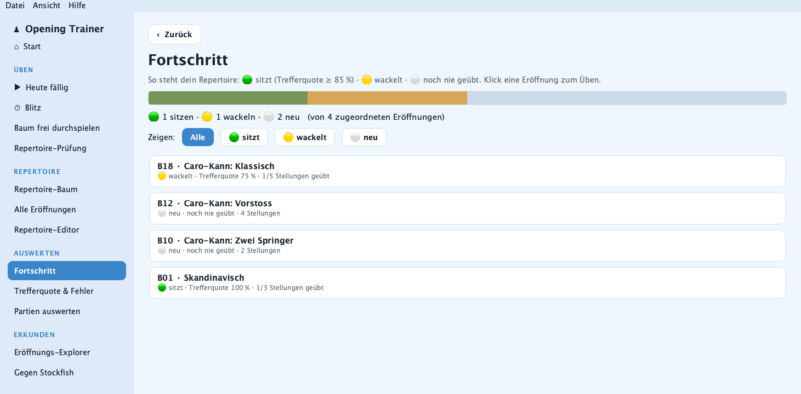

Pro Eröffnung ein Status — **🟢 sitzt** (Trefferquote ≥ 85 %), **🟡 wackelt**,
**⚪ neu** — mit „X von Y Stellungen geübt". Oben ein Balken über alles. Klick eine
Eröffnung, um sie direkt zu üben. Die Filter zeigen nur sitzende / wackelnde / neue.

---

## 11. Trefferquote & Fehler (⌘3)

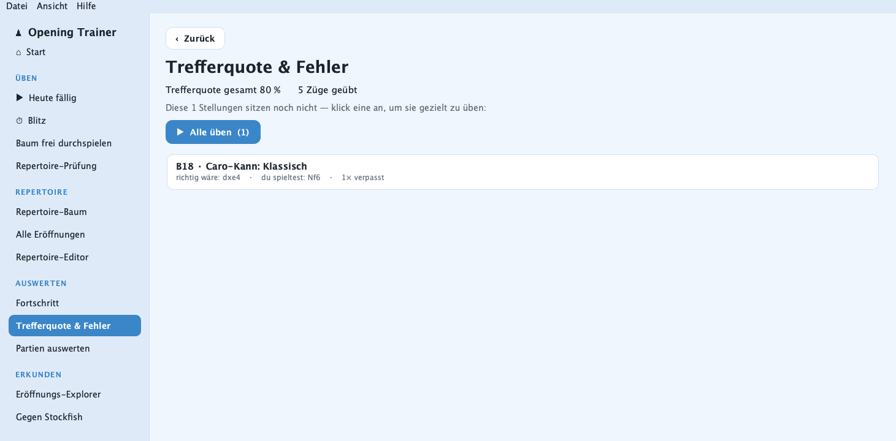

Deine **Gesamt-Trefferquote** samt Tendenz, plus die Liste der **offenen
Fehlerstellungen** (zuletzt falsch beantwortet). Klick eine an → du übst gezielt
genau diese Stellung, bis sie sitzt.

---

## 12. Alle Eröffnungen — die Bibliothek (⌘2)

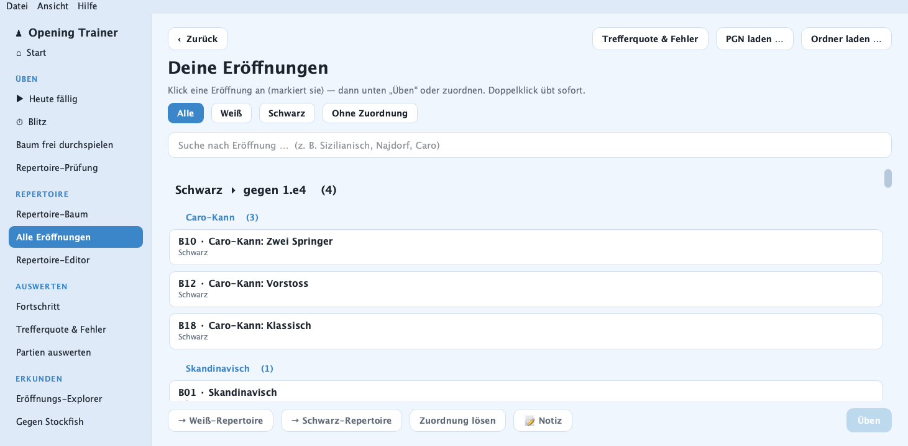

Hier durchsuchst du dein Repertoire, gruppiert nach Seite und erstem Zug. Du kannst
einzelne Eröffnungen einer **Seite zuordnen** (Weiß/Schwarz), nach Namen **suchen**
und eine Eröffnung zum Üben anklicken. Selbst im Editor gebaute Bäume erscheinen als
eigene Sektion.

---

## 13. Repertoires verwalten & aufräumen (Datei-Menü)

- **Geladene Repertoires verwalten …** — listet deine PGN-Quellen; „Ausgewählte entfernen" lädt eine aus (die Datei auf der Platte bleibt).
- **Eigene Bäume verwalten/aufräumen …** — zeigt Bäume, die zu **keiner geladenen Datei** gehören (Reste alter Importe/Studien). Hier kannst du solche „Geister" löschen, falls deine „Neu"-Zahlen unerwartet groß sind.
- **Repertoire leeren …** — entfernt **alle** Quellen und Bäume aus der App (deine PGN-Dateien bleiben).

> **Tipp bei zu großen „Neu"-Zahlen:** *Repertoire leeren* → dann deinen sauberen Ordner/Dateien neu laden. Dann zeigt die App nur dein echtes Repertoire.

---

## 14. Ansicht & Einstellungen

Im Menü **Ansicht**: **Erscheinungsbild** (**Hell/Dunkel** — die Oberfläche schaltet
sofort um und merkt sich die Wahl; im Dunkelmodus stellt sie automatisch ein passendes
Brett ein), **Brettfarbe** (Grün/Holz/Blau/Grau) und **Sprache** (Deutsch/English,
sofort umschaltbar).

---

## 15. Tastenkürzel

| Kürzel | Funktion |
|---|---|
| ⌘O / ⇧⌘O | PGN-Datei / Ordner laden |
| ⌘1 | Startseite |
| ⌘2 | Alle Eröffnungen (Bibliothek) |
| ⌘3 | Trefferquote & Fehler |
| ⌘4 | Fortschritt |
| ⌘5 | Partien auswerten |
| ⌘6 | Repertoire-Prüfung |
| ⌘R | Repertoire-Baum |
| ⌘E | Repertoire-Editor |
| ⌘D | Heute fällig |
| ⌘T | Baum frei durchspielen |
| L / Enter | (beim Üben) Lösung zeigen / Überspringen |

---

## 16. Ehrlich: was die App (noch) nicht kann

- Sie erfindet **keine Eröffnungs-Theorie**. Tiefe und Varianten kommen aus **deinen** PGNs oder aus dem, was du im Editor ergänzt. Für mehr Tiefe: variantenreiche PGNs laden oder Äste selbst bauen.
- **Erklärungen/„Ideen"** zu Zügen sind nur so reichhaltig wie **deine eigenen Notizen** in der PGN. Dafür kann **Stockfish** dir objektiv sagen, ob ein Zug gut war.
- Die App läuft **lokal auf deinem Mac**, ohne Konto und ohne Cloud.

---

*Bei Fragen: Hilfe-Menü → „Erste Schritte" / „Projektseite öffnen (GitHub)".*
